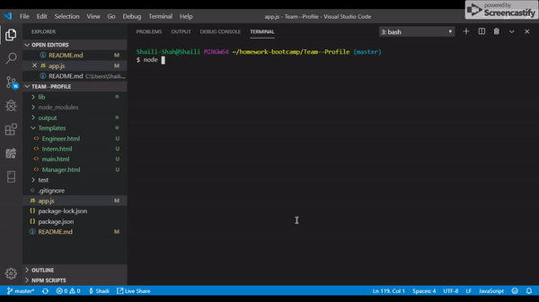
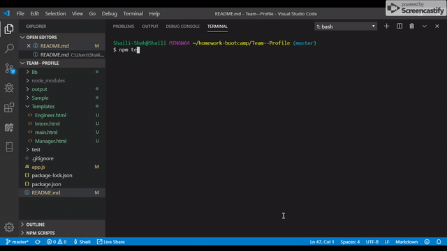

# Team--Profile

This application will use to generate team for the project.

# Author
Shaili Shah | 
[LinkedIn](https://www.linkedin.com/in/shaili-shah-88706512b/) 
| [GitHub](https://github.com/sshaili) 

# Technologies

* HTML
* CSS 
* JavaScript
* JQuery
* Node js

# Repositories
click here for Live Demo :  https://github.com/sshaili/Team--Profile

# Assumption

Node.js and node global packages installed in your environement.

# NPM Dependencies

* fs
* inquirer
* util

# To run the application

No 1. Run `npm install`.

No 2. Run `node app.js`

# Preview

# HTML Preview

# Application testcase

